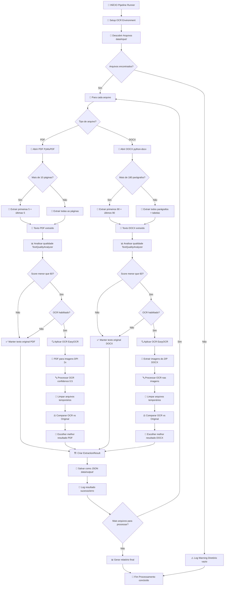

```mermaid
graph TD;
    A[🚀 INÍCIO Pipeline Runner] --> B[🔧 Setup OCR Environment];
    B --> C[📁 Descobrir Arquivos data/input/];
    C --> D{Arquivos encontrados?};
    D -->|Não| E[⚠️ Log Warning Diretório vazio];
    D -->|Sim| F[🔄 Para cada arquivo];
    F --> G{Tipo de arquivo?};
    
    %% PDF Branch (unchanged)
    G -->|PDF| H[📄 Abrir PDF PyMuPDF];
    H --> I{Mais de 10 páginas?};
    I -->|Sim| J[📑 Extrair primeiras 5 + últimas 5];
    I -->|Não| K[📄 Extrair todas as páginas];
    J --> L[📝 Texto PDF extraído];
    K --> L;
    
    L --> M[📊 Analisar qualidade TextQualityAnalyzer];
    M --> N{Score menor que 60?};
    N -->|Não| O[✅ Manter texto original PDF];
    N -->|Sim| P{OCR habilitado?};
    P -->|Não| O;
    P -->|Sim| Q[🔍 Aplicar OCR EasyOCR];
    Q --> R[📸 PDF para imagens DPI 2x];
    R --> S[🔤 Processar OCR confidence 0.5];
    S --> T[🧹 Limpar arquivos temporários];
    T --> U[⚖️ Comparar OCR vs Original];
    U --> V[📝 Escolher melhor resultado PDF];
    
    %% DOCX Branch (updated with OCR - same pattern as PDF)
    G -->|DOCX| W[📝 Abrir DOCX python-docx];
    W --> X{Mais de 180 parágrafos?};
    X -->|Sim| Y[📑 Extrair primeiros 90 + últimos 90];
    X -->|Não| Z[📄 Extrair todos parágrafos + tabelas];
    Y --> AA[📝 Texto DOCX extraído];
    Z --> AA;
    
    %% NEW: Same quality analysis and OCR logic as PDF
    AA --> BB[📊 Analisar qualidade TextQualityAnalyzer];
    BB --> CC{Score menor que 60?};
    CC -->|Não| DD[✅ Manter texto original DOCX];
    CC -->|Sim| EE{OCR habilitado?};
    EE -->|Não| DD;
    EE -->|Sim| FF[🔍 Aplicar OCR EasyOCR];
    FF --> GG[📸 Extrair imagens do ZIP DOCX];
    GG --> HH[🔤 Processar OCR nas imagens];
    HH --> II[🧹 Limpar arquivos temporários];
    II --> JJ[⚖️ Comparar OCR vs Original];
    JJ --> KK[📝 Escolher melhor resultado DOCX];
    
    %% Convergence
    O --> LL[🏗️ Criar ExtractionResult];
    V --> LL;
    DD --> LL;
    KK --> LL;
    
    LL --> MM[💾 Salvar como JSON data/output/];
    MM --> NN[📝 Log resultado sucesso/erro];
    NN --> OO{Mais arquivos para processar?};
    OO -->|Sim| F;
    OO -->|Não| PP[📊 Gerar relatório final];
    PP --> QQ[🎉 Fim Processamento concluído];
    E --> QQ;
```